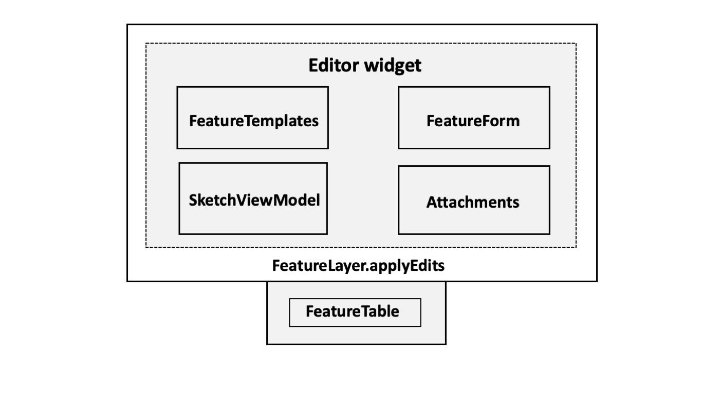

<!-- .slide: data-background="../node_modules/esri-reveal.js-templates/img/2021/dev-summit/bg-1.png" data-background-size="cover" -->

# ArcGIS API for JavaScript: Web Editing in 2D

#### Heather Gonzago
#### Paul Barker
#### JC Franco

#### http://bit.ly/editing2dds21

---

<!-- .slide: data-background="../node_modules/esri-reveal.js-templates/img/2021/dev-summit/bg-3.png" data-background-size="cover" -->

## Agenda

* Web Editing
* Editing Widgets
* Smart Forms
* Customizing the Editor
* Q&A

---

## Web Editing

<!-- .slide: data-background="../node_modules/esri-reveal.js-templates/img/2021/dev-summit/bg-3.png" data-background-size="cover" -->

---

## Enable editing on feature service 

* One or more [feature layers](https://developers.arcgis.com/rest/services-reference/feature-service.htm)
* [Must be enabled for editing](https://enterprise.arcgis.com/en/server/latest/publish-services/windows/editor-permissions-for-feature-services.htm)
* [Constraints are set at the service level](./images/editor-permissions.png)
  * Client app cannot override permissions set on service
  * Consistent behavior across all clients

---

## Under the hood, it's just REST

[ArcGIS REST API](https://developers.arcgis.com/rest/services-reference/apply-edits-feature-service-.htm)

ArcGIS Online

ArcGIS API for JavaScript

---

## Web editing in the browser

🔑 [Configurable widgets](https://hgonzago.esri.com/javascript/latest/api-reference/) | ⌨️ Granular APIs

---

<!-- .slide: data-background="../node_modules/esri-reveal.js-templates/img/2021/dev-summit/bg-4.png" data-background-size="cover" -->

## Sketch Demo

---

<!-- .slide: data-background="../node_modules/esri-reveal.js-templates/img/2021/dev-summit/bg-4.png" data-background-size="cover" -->

## Editor Demo

---

<!-- .slide: data-background="../node_modules/esri-reveal.js-templates/img/2021/dev-summit/bg-4.png" data-background-size="cover" -->

## FeatureTable Demo

---

<!-- .slide: data-background="../node_modules/esri-reveal.js-templates/img/2021/dev-summit/bg-3.png" data-background-size="cover" -->

## Smart Forms

---

# Smart Forms

* Consistent editing experience
* Improve the quality of your data
* Provide logic and structure
* Data driven rules and validation

---

## Demo

<!-- .slide: data-background="../node_modules/esri-reveal.js-templates/img/2021/dev-summit/bg-4.png" data-background-size="cover" -->

---

<!-- .slide: data-background="../node_modules/esri-reveal.js-templates/img/2021/dev-summit/bg-3.png" data-background-size="cover" -->

## Customizing the Editor

---

## Editor API

[ArcGIS SDK - Editor](https://next.sites.afd.arcgis.com/javascript/latest/api-reference/esri-widgets-Editor.html) 

---

## Customization options

1. <!-- .element: class="fragment" data-fragment-index="0" --> Control edit options per layer
    - <!-- .element: class="fragment" data-fragment-index="0" --> toggle whether add/update/delete/attachments are allowed
1. <!-- .element: class="fragment" data-fragment-index="1" --> Define form templates locally 
1. <!-- .element: class="fragment" data-fragment-index="2" --> Enable snapping
1. <!-- .element: class="fragment" data-fragment-index="3" --> Use properties from supporting widgets to tweak experience
1. <!-- .element: class="fragment" data-fragment-index="4" --> Start editor workflows at different steps
1. <!-- .element: class="fragment" data-fragment-index="5" --> Watch viewModel properties to react to workflow steps

---

<!-- .slide: data-background="../node_modules/esri-reveal.js-templates/img/2021/dev-summit/bg-4.png" data-background-size="cover" -->

## Demo

---

<!-- .slide: data-background="../node_modules/esri-reveal.js-templates/img/2021/dev-summit/bg-3.png" data-background-size="cover" -->

## Recap

* Web editing overview 
* OOB Editor features  
* Smart Forms in the Editor 
* Customized Editor 

---

<section data-markdown data-background="../node_modules/esri-reveal.js-templates/img/2021/dev-summit/bg-5.png">

Please provide your feedback for this session by clicking on the session survey link directly below the video

<!-- .element: style="margin: 0 20%;" -->

---

<!-- .slide: data-background="../node_modules/esri-reveal.js-templates/img/2021/dev-summit/bg-3.png" data-background-size="cover" -->

# Questions? 🤔

> Where can I find the slides/source?

[bit.ly/editing2dds21](http://bit.ly/editing2dds21)

> Where can I submit a question?

[bit.ly/askjsapi](http://bit.ly/askjsapi)

---

<section data-markdown data-background="../node_modules/esri-reveal.js-templates/img/2021/dev-summit/bg-5.png">

